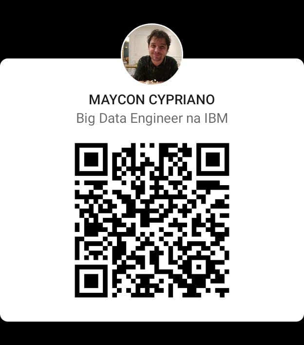

### <b>"Without data you're just another person with an opinion."</b> 
##### <i> William Edwards Deming </i>

**Data engineer** 
 How to start a story about me? First, of course, I must say my name. Maycon Cypriano Batestin. I have schooling, of course. I know English (by the way!), And I love cinema and computers. My favorite movie? Jurassic Park (the first!). What do I do? Well, that’s the big question, right? I work with programming languages ​​like R, Python, Julia, Spark, Scala and Java. They are part of the arsenal of tools used to develop a task in Big Data.
For me, being a Data Pythonist is the programming skill that allows the Data Engineer to put his creativity into practice and extract from the data answers to questions that have not yet been asked.
I am endowed with creativity (at least, so they say!), Companionship and a lot of dedication. Above all, I am a devotee of God and I believe that talking about myself in the third person is not arrogance, it is just a style of narrative that I try to use to draw your attention to what I really want you to see, in my way of to be!. 

 

 ## 🚀 **Languages and Tools:**

 
 
 
 
 
 
 
 
 
 
 
 
 
 
 
 
 
 
 
 
 
 
 
 
 
 
 
 
 
 

>> <h3> Useful links </h3>

> 
